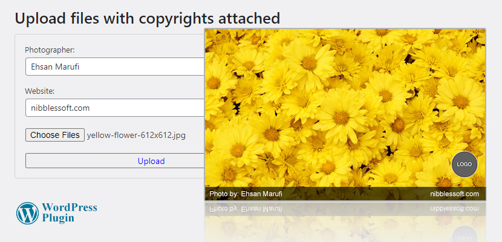

# Image Copyrights WordPress Plugin
Easily insert copyright texts on your images through a WordPress Plugin

Copyright texts can be easily inserted on your images with the plugin. Simply copy the `image-copyrights` folder into the WordPress plugin directory. In order to run this plugin, you will need to install the [GD library](https://stackoverflow.com/a/13338387/3709765). 

All the code is released to Public Domain. Patches and comments are welcome.
It makes me happy to hear if someone finds the algorithms and the implementations useful.

Ehsan Marufi 
August 2015